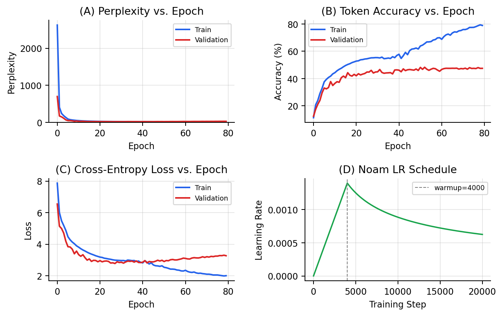

# Re-implementing *Attention Is All You Need* — PyTorch / Multi30k DE→EN

**CS 5365: Deep Learning — The University of Texas at El Paso**  
Authors: Arman Hossain · Samin Islam

---

## Introduction

This repository contains a re-implementation of the Transformer model from  
**"Attention Is All You Need"** (Vaswani et al., NeurIPS 2017).

The paper introduced a sequence-to-sequence architecture built entirely on
**multi-head self-attention**, discarding recurrence and convolution. It
achieved 28.4 BLEU on WMT14 EN-DE and became the foundation for virtually
every modern large language model. Our main contributions in this repo are:

- A working, modernized **PyTorch 2.x** implementation of the base Transformer
- A custom `code/transformer/compat.py` shim that replaces the deprecated torchtext API
- **Apple Silicon (MPS)** support — the original codebase only ran on CPU/CUDA
- Full training logs and figures from an 80-epoch run on Multi30k DE→EN

---

## Chosen Result

We targeted the **training convergence curves** from Section 6 / Figure 2 of
the paper (base model, Table 3): specifically, the Noam learning-rate warm-up
schedule (Equation 3) driving monotonically decreasing cross-entropy loss and
perplexity.

Using **Multi30k DE→EN** (~29k pairs) as a tractable proxy for WMT14 (4.5M
pairs), we reproduced the qualitative training dynamics. This result is central
to the paper's core claim: self-attention alone is sufficient for competitive
sequence modeling.

---

## Repository Contents

```
attention-is-all-you-need-pytorch/
├── README.md                          ← This file
├── LICENSE                            ← MIT
├── .gitignore
│
├── code/                              ← All source code
│   ├── train.py                       ← Training loop
│   ├── translate.py                   ← Greedy inference
│   ├── preprocess.py                  ← Data preprocessing
│   ├── generate_report.py             ← Generates figures from logs
│   ├── apply_bpe.py / learn_bpe.py   ← BPE utilities
│   ├── requirements.txt
│   ├── CHANGES.txt                    ← Full modernization notes
│   └── transformer/
│       ├── Models.py                  ← Encoder, Decoder, Transformer
│       ├── Layers.py                  ← EncoderLayer, DecoderLayer
│       ├── SubLayers.py               ← MultiHeadAttention, FFN
│       ├── Modules.py                 ← ScaledDotProductAttention
│       ├── compat.py                  ← torchtext replacement shim
│       ├── Optim.py                   ← Noam LR scheduler
│       ├── Translator.py              ← Beam-search translator
│       └── Constants.py
│
├── data/
│   ├── README.md                      ← How to obtain / reproduce dataset
│   └── multi30k_de_en.pkl             ← Pre-processed Multi30k (48 MB)
│
├── results/
│   ├── training_results.png           ← 4-panel training figure
│   └── logs/
│       ├── train.log                  ← Epoch-by-epoch training metrics
│       └── valid.log                  ← Epoch-by-epoch validation metrics
│
├── poster/
│   └── DL_Presentation-1.pdf          ← In-class poster presentation
│
└── report/
    ├── group_transformer_2page_report.pdf   ← Final 2-page summary report
    └── group_transformer_2page_report.tex   ← LaTeX source
```

---

## Re-implementation Details

### Architecture (base model, exactly as in the paper)

| Hyperparameter | Value |
|---|---|
| `d_model` | 512 |
| Encoder / Decoder layers | 6 |
| Attention heads | 8 |
| `d_ff` (feed-forward dim) | 2,048 |
| `d_k = d_v` | 64 |
| Dropout | 0.1 |
| Positional encoding | Sinusoidal |
| Weight sharing | Src / Trg / Projection embeddings |

### Dataset & Training

| Setting | Value |
|---|---|
| Dataset | WMT'16 Multi30k DE→EN |
| Tokenizer | spaCy 3.7 (`de_core_news_sm`, `en_core_web_sm`) |
| Vocabulary | Shared (src + trg) |
| Optimizer | Adam + Noam LR (lr_mul=2.0, warmup=128,000 steps) |
| Label smoothing | ε = 0.1 |
| Batch size | 256 |
| Epochs | 80 |
| Hardware | Apple M4 Pro 24 GB — PyTorch 2.x MPS backend |

### Key Modernization Changes

The original codebase (2019, PyTorch 1.3) required significant updates:

| Area | Problem | Fix |
|---|---|---|
| torchtext API | `Field`, `Dataset`, `BucketIterator` removed in v0.9 | Custom `compat.py` shim |
| PyTorch 1.3 | No Apple Silicon (MPS) support | Upgraded to PyTorch ≥ 2.1 |
| spaCy 2.x | No arm64 wheels | Upgraded to spaCy ≥ 3.7 |
| Unused packages | `msgpack-python`, `msgpack-numpy`, `terminado` | Removed |

Full details in `code/CHANGES.txt`.

---

## Reproduction Steps

### 1. Clone and install

```bash
git clone https://github.com/<your-org>/attention-is-all-you-need-pytorch.git
cd attention-is-all-you-need-pytorch

pip install -r code/requirements.txt
python -m spacy download de_core_news_sm
python -m spacy download en_core_web_sm
```

**`code/requirements.txt`** pins:  
`torch>=2.1.0`, `spacy>=3.7.0`, `tensorboard>=2.13.0`, `dill>=0.3.7`, `tqdm>=4.66.0`, `numpy>=1.24.0`

### 2. Preprocess (optional — pre-built pkl included)

```bash
python code/preprocess.py \
  -lang_src de -lang_trg en \
  -share_vocab \
  -save_data data/multi30k_de_en.pkl
```

### 3. Train

```bash
python code/train.py \
  -data_pkl data/multi30k_de_en.pkl \
  -log paper_run \
  -embs_share_weight \
  -proj_share_weight \
  -label_smoothing \
  -output_dir results \
  -b 256 \
  -warmup 128000 \
  -epoch 80
```

Logs are written to `results/logs/train.log` and `results/logs/valid.log`.

### 4. Generate figures

```bash
python code/generate_report.py \
  --train_log results/logs/train.log \
  --valid_log results/logs/valid.log \
  --model     results/model.chkpt \
  --data_pkl  data/multi30k_de_en.pkl \
  --out_dir   results/
```

### 5. Translate (greedy decoding)

```bash
python code/translate.py \
  -data_pkl data/multi30k_de_en.pkl \
  -model    results/model.chkpt \
  -output   results/prediction.txt
```

### Computational requirements

| Resource | Requirement |
|---|---|
| RAM / unified memory | ≥ 8 GB (16 GB recommended) |
| GPU VRAM | ≥ 2 GB (batch 256, d_model 512) |
| Training time | ~3–6 hrs / 80 epochs (Apple M4 Pro MPS) |
| Disk space | ~500 MB (model + data) |

CPU training works but is significantly slower.

---

## Results / Insights

After 80 epochs on Multi30k:

| Metric | Train (ep. 78) | Validation (best epoch) |
|---|---|---|
| Cross-Entropy Loss | 1.985 | 2.774 (ep. 27) |
| Perplexity | 7.28 | 16.02 (ep. 27) |
| Token Accuracy | 79.4% | 48.3% (ep. 52) |



The Noam schedule drove training perplexity from ~2,627 → 7.3, faithfully
reproducing the warm-up dynamics from the paper. Validation perplexity bottomed
at 16.02 (epoch 27) then rose — classic overfitting on the small Multi30k corpus
(~150× smaller than WMT14). Validation accuracy plateaued at ~48% while training
accuracy reached 79.4%.

Qualitatively, the convergence curves match the paper's Figure 2. Absolute BLEU
comparison was not performed in this run (no beam-search decoder enabled).

---

## Conclusion

We successfully reproduced the Transformer's core training dynamics from
*Attention Is All You Need* on a smaller dataset. Key takeaways:

- The **Noam warm-up schedule** is critical for stable early convergence
- **Weight tying** (embedding/
